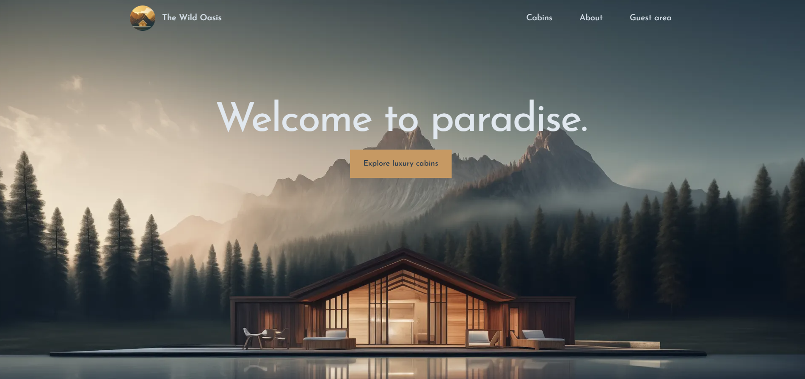
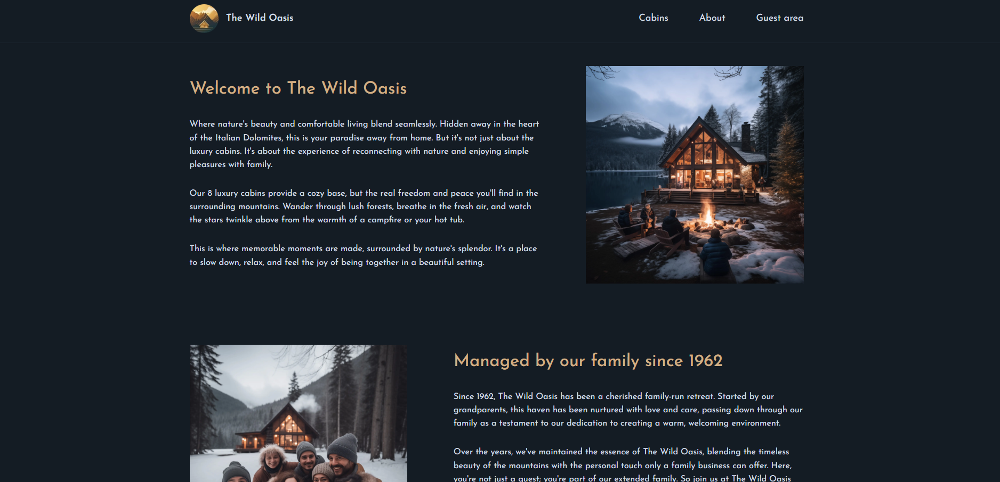
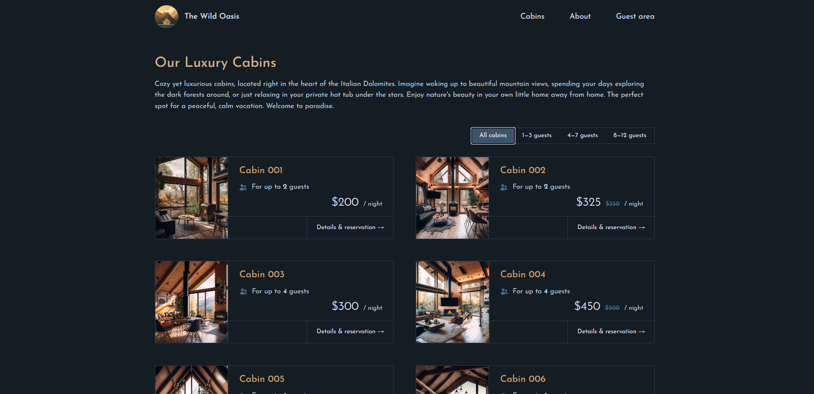
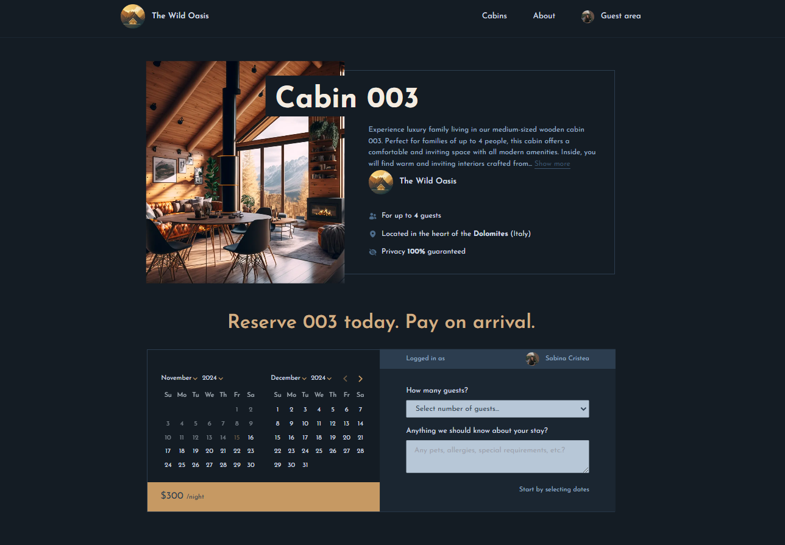
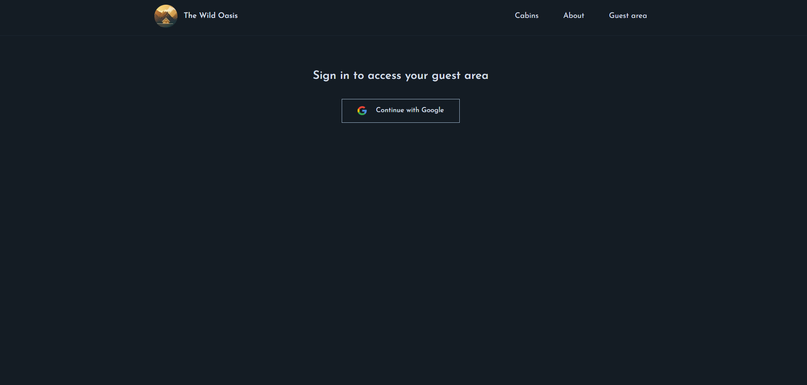
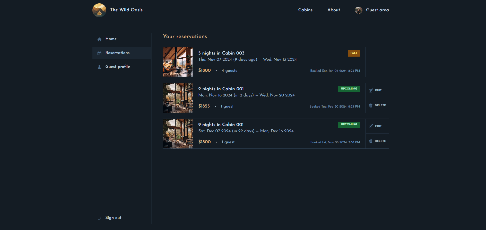
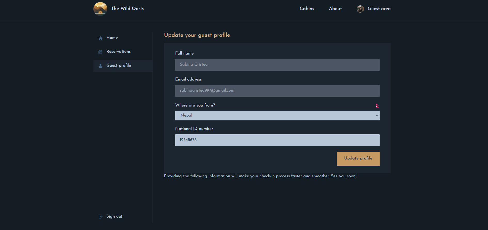

# 🏕️ Cabin Reservation Platform

A feature-rich **Cabin Reservation Platform** built with **Next.js**, designed to provide users with a seamless experience for reserving cabins. This platform supports **Google Authentication**, cabin booking, reservation management, and user profile updates, with data securely stored using **Supabase**.

## Live Demo

Click [here](https://wild-oasis-nextjs-six.vercel.app/) to see the live demo of the Wild Oasis.

## ✨ Features

### 🔐 User Authentication

- **Google Sign-In** for secure and quick login.
- Authentication handled by **NextAuth.js**.

### 🏡 Cabin Reservation System

- **Browse and Reserve** available cabins effortlessly.
- Real-time availability checks ensure accurate bookings.

### 📅 Reservation Management

- **Dashboard** to view current and past reservations.
- Options to **edit**, **update**, or **cancel** reservations.

### 🧑‍💼 User Profile Management

- View and **update user details**.
- Data managed securely with **Supabase**.

### 💻 Modern UI/UX

- Styled with **Tailwind CSS** for a clean, modern look.

## 🛠️ Technology Stack

- **Frontend**: [Next.js](https://nextjs.org/)
- **Authentication**: [NextAuth.js](https://next-auth.js.org/)
- **Backend**: Next.js API Routes
- **Database**: [Supabase](https://supabase.io/)
- **Styling**: [Tailwind CSS](https://tailwindcss.com/)

## 📸 Screenshots

### Home Page

### About The Business

### Cabins List

### Reserve a cabin

### Authenticate

### User Reservation

### User Profile Management

## License

This project is licensed under [Jonas Schmedtmann](https://github.com/jonasschmedtmann).

## Contact

For any questions or inquiries, please feel free to reach out to me at sabinacristea997@gmail.com.
